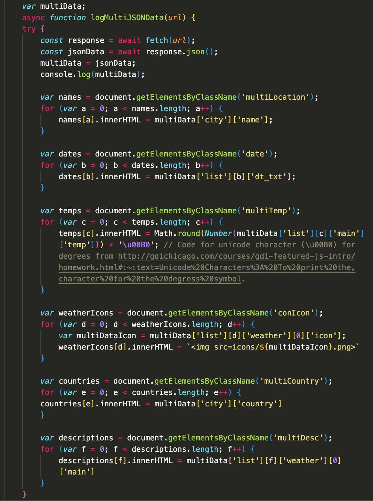
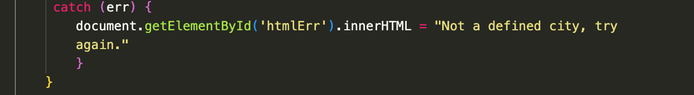

# hello_weather!
Have you gotten sick of the weather app on your phone? Well, this web application utilizes a weather API that tracks weather in realtime, and guess what, it will track the weather of any location you choose! Try it out ;)

---
Okay now that the ~*filthy CASUALS*~ are gone, we can get to the juicy piece of this us nerds appreciate `the code!`

Here's some of the JavaScript in my code:




Here it is in a code-block:

```javascript
 var multiData;
    async function logMultiJSONData(url) {
    try {
        const response = await fetch(url);
        const jsonData = await response.json();
        multiData = jsonData;
        console.log(multiData);

        var names = document.getElementsByClassName('multiLocation');
        for (var a = 0; a < names.length; a++) {
            names[a].innerHTML = multiData['city']['name'];
        }
        
        var dates = document.getElementsByClassName('date');
        for (var b = 0; b < dates.length; b++) {
            dates[b].innerHTML = multiData['list'][b]['dt_txt'];
        }

        var temps = document.getElementsByClassName('multiTemp');
        for (var c = 0; c < temps.length; c++) {
            temps[c].innerHTML = Math.round(Number(multiData['list'][c]['main']['temp'])) + '\u00B0'; // Code for unicode character (\u00B0) for degrees from http://gdichicago.com/courses/gdi-featured-js-intro/homework.html#:~:text=Unicode%20Characters%3A%20To%20print%20the,character%20for%20the%20degress%20symbol.
        }

        var weatherIcons = document.getElementsByClassName('conIcon');
        for (var d = 0; d < weatherIcons.length; d++) {
            var multiDataIcon = multiData['list'][d]['weather'][0]['icon'];
            weatherIcons[d].innerHTML = ``
        }

        var countries = document.getElementsByClassName('multiCountry');
        for (var e = 0; e < countries.length; e++) {
        countries[e].innerHTML = multiData['city']['country']
        }

        var descriptions = document.getElementsByClassName('multiDesc');
        for (var f = 0; f < descriptions.length; f++) {
            descriptions[f].innerHTML = multiData['list'][f]['weather'][0]['main']
        }
    }
     catch (err) {
        document.getElementById('htmlErr').innerHTML = "Not a defined city, try again."
        }
    }
```

This segment of code is the probably the most important/complex portion of the JavaScript that ***I WROTE***. Many parts of the code, such as the utilization of `for` loops, the unicode symbol for `˚`, and the use of template literals (`${}`) have been learned from other places, but I have utilized these techniques and concepts in my *own* way, and I hereby certify that I have written all this code on my own. Once again[^1], you just gotta trust me, [I am an engineer!](https://www.youtube.com/watch?v=rp8hvyjZWHs&ab_channel=TheVilkaz)

I will now briefly explain this code segment. Afterwards, I suggest you simply check out the website and see what it has to offer! I accept any type of constructive criticism!

1. Firstly we initialize a global varibale called `multiData`, which is what we will use to call elements from the JSON object we are fetching *(more on that later)*
2. We initialize an async function that will run seperately from the program flow called `logMultiJSONData` with the paramter URL, which will be the API we want to fetch data from, which in this case is OpenWeatherAPI, and in that function we put a `try` statement that will attempt to run all the code to fetch and display specific elements from the OpenWeatherAPI JSON object.
3. Now, we create two constants, `const response = await fetch(url);`, which will await for a fetch request from the URL of our choosing, and `const jsonData = await response.json();`, which will await for the JSON object that the fetch request retruns.
4. After creating our constants, we set the variable `multiData` we created earlier equal to the constnat `jsonData`, and we do this as the constnat `jsonData` is already awaiting for the JSON object from the fetch request, so it will not be able to also call and display elements from the JSON object simultaneously, so we set `multiData` as a placeholder for `jsonData` so that we are able to recieve the JSON object and call and display its elements at the same time.
5. Now, we simply log the JSON object fetched through `multiData`.
6. Next, we must display our data. In this case, we will be displaying the same type of data multiple times, as we will be displaying weather conditions in 3 hr increments over a 5 day time period, and the JSON object fetched for such has multiple arrays, and therefore we can't just use `document.getElementById()` to display data once, we must utilize `document.getElementsByClassName()` &. `for` loops.
7. Each `for` loop follows a similar stricture: First, a variable is initialized that is assigned to elements with a specific class name in HTML, which will allow us to control what data to display in all the elements with that specific class; next, the `for` loop is initialized, where a variable is set to 0 as that will be the starting point for the arrays in the JSON object and elements with that specific class name, the variable is set so that it loops so long as its value is always less than the amount of times that class is present in an element, and the variable is increasing by one each time it loops. Finally, within the loop, the variable is iterated with the varible defined in the for loop, and the `innerHTML` of the variable equal to the classes is set to the data we want to display, in which the array we call is set to the variable we initialized in the `for` loop, so that the data displayed is in chronological order of the array. However, not all the for loops call one of the arrays as the simply call an element outside the `list` part of the JSON object, and in the for loop for the condition-images, another variable is initialized within the loop that is equal to the value of the icon id, and then that in turn is iterated and the innerHTML of that class is set to an  tag where the src is equal to the 'icons/(whatever the condition id is)'
8. Finally, after the `try` statement housing all the code, there is a `catch (err)` statement, which will identify if any erros occur and catch them, and instead of displaying them in the console, an error message will display in a <div> with a specific id, which disappears if another fetch procedure is made that is successful, that code being in another function.
9. However, the errors relating to a bad fetch request still display, as they are asynchronous from the code flow and will not stop even if they are caught.
10. And that's it! That's probably my most complex piece of code that I wrote for this project in a nutshell.

***What are you waiting for? Check out the rad website!***


[^1]: [I've made this reference before! You gotta find it for yourslef ;)](https://mg8mer.github.io/ammans-best-restaurants/)
